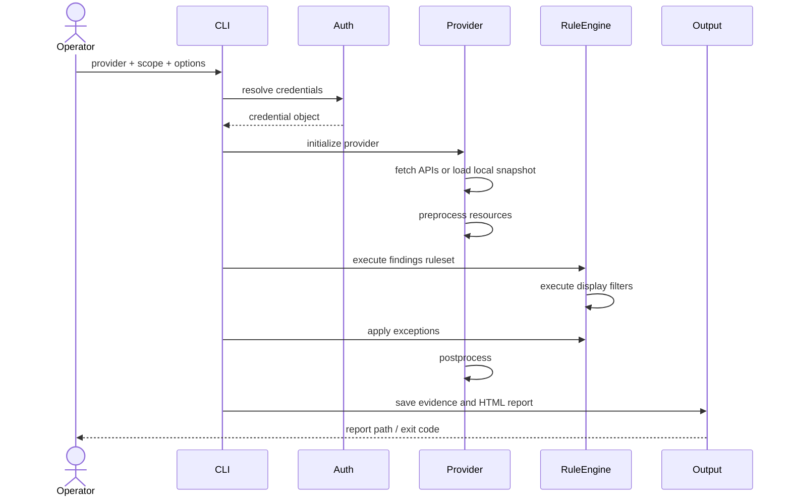
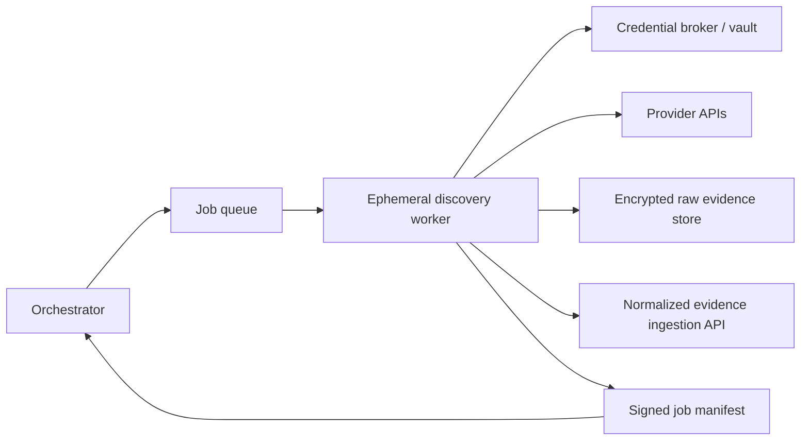

# Enterprise Cloud Discovery Engine

[](#requirements)
[](LICENSE)
[](#project-status)
[](#maintainer-and-support)

**Multi-cloud configuration discovery, evidence collection, rule evaluation, and security reporting for AWS, Azure, Google Cloud, Alibaba Cloud, Oracle Cloud Infrastructure, DigitalOcean, and Kubernetes.**

> **Maintained by DevOps Lab Inc.**  
> Contact: **hello@devopslabinc.com**

---

## Table of contents

- [Overview](#overview)
- [Project status](#project-status)
- [What the engine does](#what-the-engine-does)
- [Implemented providers](#implemented-providers)
- [Architecture](#architecture)
- [Execution lifecycle](#execution-lifecycle)
- [Repository layout](#repository-layout)
- [Requirements](#requirements)
- [Installation](#installation)
- [Quick start](#quick-start)
- [Authentication and provider examples](#authentication-and-provider-examples)
- [Common command-line options](#common-command-line-options)
- [Service selection and scoping](#service-selection-and-scoping)
- [Reports and evidence output](#reports-and-evidence-output)
- [Rules, filters, and exceptions](#rules-filters-and-exceptions)
- [Local re-analysis and partial updates](#local-re-analysis-and-partial-updates)
- [SQLite report serving](#sqlite-report-serving)
- [Programmatic use](#programmatic-use)
- [Docker](#docker)
- [Platform integration](#platform-integration)
- [Developer tools](#developer-tools)
- [Testing and validation](#testing-and-validation)
- [Security guidance](#security-guidance)
- [Troubleshooting](#troubleshooting)
- [Known limitations](#known-limitations)
- [Development and contribution](#development-and-contribution)
- [Roadmap](#roadmap)
- [License and attribution](#license-and-attribution)
- [Maintainer and support](#maintainer-and-support)

---

## Overview

Enterprise Cloud Discovery Engine is a Python-based, provider-pluggable discovery and security-analysis engine. It authenticates to an in-scope cloud or Kubernetes environment, gathers configuration data, normalizes that data into the engine's provider model, evaluates JSON-defined finding rules and display filters, applies approved exceptions, and produces a browser-based report backed by JSON or experimental SQLite results.

The repository is designed to serve two related purposes:

1. **Standalone discovery and reporting:** run a provider scan from the command line and review the generated HTML report.
2. **Discovery worker for a larger platform:** execute the engine behind an orchestrator, preserve native evidence, export normalized records, and return a job manifest to the Enterprise Cloud Security Platform.

This README distinguishes between:

- **Implemented:** code and configuration present in this repository.
- **Experimental:** present in the repository but explicitly marked experimental by the CLI or requiring further hardening.
- **Platform integration design:** documented contracts and intended service boundaries that are not fully delivered by the standalone engine.
- **Roadmap:** proposed future capabilities; not represented as current functionality.

---

## Project status

The package reports version **5.14.0** and is classified as **Beta** in `setup.py`.

| Area | Status | Notes |
|---|---|---|
| Provider discovery | Implemented | Seven provider entry points are registered. |
| Rule engine | Implemented | JSON rulesets, findings, filters, and exceptions are processed locally. |
| HTML report | Implemented | Generated after collection and analysis. |
| JSON result store | Implemented | Default result format. |
| SQLite result store/server | Experimental | Exposed through `--result-format sqlite` and `--serve`. |
| Docker build variants | Implemented scaffolding | Base, AWS, Azure, GCP, and combined build configuration are present. |
| Normalized platform export | Implemented foundation | `integration/normalized_export.py` exists; full production worker orchestration remains a platform concern. |
| Queue-based worker deployment | Integration design | Defined in `docs/PLATFORM_INTEGRATION.md`; not a complete queue service in this repository. |
| Executive migration intelligence | Roadmap / external platform | Not part of the standalone scanner's current execution path. |

---

## What the engine does

A normal run performs the following operations:

1. Parse provider-specific and common CLI arguments.
2. Configure console and optional file logging.
3. Resolve an authentication strategy.
4. Create the requested provider object.
5. Initialize report storage.
6. Fetch provider data unless `--local` is selected.
7. Preprocess resources, including optional known-IP enrichment.
8. Load and execute a finding ruleset.
9. Load and execute display-filter rules.
10. Apply an optional exception file.
11. Postprocess the provider model and run metadata.
12. Save JSON or SQLite results and generate the HTML report.
13. Open the report in a browser unless `--no-browser` is used.

The process returns nonzero status codes for authentication, initialization, collection, analysis, and output failures. See [Exit behavior](#exit-behavior).

---

## Implemented providers

The following inventory is generated from the repository's provider modules and finding-definition directories.

| Provider code | Platform | Service/resource modules | Finding definitions |
|---|---|---:|---:|
| `aws` | Amazon Web Services | 27 | 147 |
| `azure` | Microsoft Azure | 12 | 81 |
| `gcp` | Google Cloud Platform | 12 | 119 |
| `aliyun` | Alibaba Cloud | 7 | 18 |
| `oci` | Oracle Cloud Infrastructure | 3 | 10 |
| `do` | DigitalOcean | 5 | 29 |
| `kubernetes` | Kubernetes | 0 | 174 |

> Counts describe files included in this repository. They do not guarantee that every cloud API, resource type, region, subscription model, or newly released service is covered.

### Amazon Web Services (`aws`)

**Implemented resource/service modules:** `acm`, `awslambda`, `cloudformation`, `cloudfront`, `cloudtrail`, `cloudwatch`, `codebuild`, `config`, `directconnect`, `dynamodb`, `ec2`, `efs`, `elasticache`, `elb`, `elbv2`, `emr`, `iam`, `kms`, `rds`, `redshift`, `route53`, `s3`, `secretsmanager`, `ses`, `sns`, `sqs`, `vpc`

**Included finding definitions:** 147

List the services recognized by the installed build:

```bash
enterprise-cloud-discovery aws --list-services [authentication options]
```

### Microsoft Azure (`azure`)

**Implemented resource/service modules:** `aad`, `appservice`, `keyvault`, `loggingmonitoring`, `mysqldatabase`, `network`, `postgresqldatabase`, `rbac`, `securitycenter`, `sqldatabase`, `storageaccounts`, `virtualmachines`

**Included finding definitions:** 81

List the services recognized by the installed build:

```bash
enterprise-cloud-discovery azure --list-services [authentication options]
```

### Google Cloud Platform (`gcp`)

**Implemented resource/service modules:** `bigquery`, `cloudsql`, `cloudstorage`, `dns`, `functions`, `gce`, `gke`, `iam`, `kms`, `memorystore`, `stackdriverlogging`, `stackdrivermonitoring`

**Included finding definitions:** 119

List the services recognized by the installed build:

```bash
enterprise-cloud-discovery gcp --list-services [authentication options]
```

### Alibaba Cloud (`aliyun`)

**Implemented resource/service modules:** `actiontrail`, `ecs`, `kms`, `oss`, `ram`, `rds`, `vpc`

**Included finding definitions:** 18

List the services recognized by the installed build:

```bash
enterprise-cloud-discovery aliyun --list-services [authentication options]
```

### Oracle Cloud Infrastructure (`oci`)

**Implemented resource/service modules:** `identity`, `kms`, `objectstorage`

**Included finding definitions:** 10

List the services recognized by the installed build:

```bash
enterprise-cloud-discovery oci --list-services [authentication options]
```

### DigitalOcean (`do`)

**Implemented resource/service modules:** `database`, `droplet`, `kubernetes`, `networking`, `spaces`

**Included finding definitions:** 29

List the services recognized by the installed build:

```bash
enterprise-cloud-discovery do --list-services [authentication options]
```

### Kubernetes (`kubernetes`)

**Implemented resource/service modules:** Provider-specific Kubernetes resources and controls (not organized as service folders).

**Included finding definitions:** 174

List the services recognized by the installed build:

```bash
enterprise-cloud-discovery kubernetes --list-services [authentication options]
```

---

## Architecture

```mermaid
flowchart LR
    CLI[CLI or Python caller] --> AUTH[Authentication strategy]
    AUTH --> PROVIDER[Provider implementation]
    PROVIDER --> API[Cloud or Kubernetes APIs]
    API --> MODEL[Provider resource model]
    MODEL --> PRE[Preprocessing]
    PRE --> RULES[Finding ruleset]
    RULES --> FILTERS[Display filters]
    FILTERS --> EXCEPTIONS[Approved exceptions]
    EXCEPTIONS --> POST[Postprocessing]
    POST --> JSON[JSON evidence/results]
    POST --> SQLITE[Experimental SQLite results]
    JSON --> HTML[HTML report]
    SQLITE --> SERVER[Local report server]
```



### Core components

| Component | Path | Responsibility |
|---|---|---|
| CLI parser | `EnterpriseCloudDiscovery/core/cli_parser.py` | Provider selection, authentication flags, scope, output, rules, and runtime controls. |
| Processing engine | `EnterpriseCloudDiscovery/core/processingengine.py` | Executes finding and filter rules against provider data. |
| Rules and rulesets | `EnterpriseCloudDiscovery/core/rule.py`, `ruleset.py` | Loads and evaluates JSON-defined rules. |
| Exception handling | `EnterpriseCloudDiscovery/core/exceptions.py` | Applies documented exceptions to findings. |
| Provider factory | `EnterpriseCloudDiscovery/providers/` | Resolves provider and authentication implementations. |
| Output encoder | `EnterpriseCloudDiscovery/output/result_encoder.py` | Persists result data in supported formats. |
| HTML report | `EnterpriseCloudDiscovery/output/html.py` | Generates the report application and output paths. |
| SQLite server | `EnterpriseCloudDiscovery/core/server.py` | Serves experimental SQLite-backed report data. |
| Normalized export | `EnterpriseCloudDiscovery/integration/normalized_export.py` | Foundation for platform-oriented normalized records. |

### Provider pattern

Each provider generally includes:

```text
providers/<provider>/
├── authentication_strategy.py
├── provider.py
├── services.py
├── facade/                 # API wrappers
├── resources/              # resource models and fetch logic
├── rules/
│   ├── findings/           # individual JSON controls
│   └── rulesets/           # named rule collections
└── metadata.json
```

The exact structure differs by provider. Consumers should rely on the public provider factory and CLI rather than importing undocumented internal modules directly.

---

## Execution lifecycle



### Exit behavior

The current runner uses these notable return codes:

| Code | Meaning |
|---:|---|
| `0` | Completed without handled errors. |
| `101` | Authentication failure. |
| `102` | Provider initialization failure. |
| `103` | Report initialization failure. |
| `104` | Unhandled data-collection failure. |
| `105` | Preprocessing failure. |
| `106` | Finding-rule engine failure. |
| `107` | Display-filter failure. |
| `108` | Postprocessing failure. |
| `109` | Report-generation failure. |
| `130` | Interrupted by the user. |
| `200` | Completed, but handled errors were recorded. |

Automation should treat `0` as clean success, `200` as completed-with-errors, and other nonzero values as failed or interrupted execution.

---

## Repository layout

```text
.
├── EnterpriseCloudDiscovery/
│   ├── __main__.py                # CLI and programmatic runner
│   ├── core/                      # parsing, rules, processing, server, utilities
│   ├── data/                      # protocol and ICMP reference data
│   ├── integration/               # normalized platform-export foundation
│   ├── output/                    # encoders and HTML report generation
│   └── providers/                 # provider implementations and finding rules
├── docker/                        # provider-specific and combined image definitions
├── docs/
│   └── PLATFORM_INTEGRATION.md    # worker boundary and canonical mapping contract
├── tests/                         # unit tests and fixtures
├── tools/                         # development and export utilities
├── scout.py                       # compatibility entry point
├── setup.py                       # package metadata and console entry point
├── requirements.txt               # runtime dependencies
├── dev-requirements.txt           # development/test dependencies
├── LICENSE                        # proprietary, Copyright (c) DevOps Lab Inc.
└── THIRD_PARTY_NOTICES.md         # upstream notices and attribution
```

Generated bytecode folders such as `__pycache__/` are not source and should remain excluded from commits.

---

## Requirements

### Supported Python versions

`setup.py` declares Python **3.9, 3.10, and 3.11**. Python 3.12+ is not declared as supported and may expose compatibility issues in pinned cloud SDK versions.

### Runtime dependencies

The project uses provider SDKs and supporting libraries, including:

- AWS: `boto3`, `botocore`, `policyuniverse`
- Azure: `azure-identity`, multiple `azure-mgmt-*` packages, `msgraph-core`
- GCP: Google Cloud client libraries and `google-api-python-client`
- Alibaba Cloud: `aliyun-python-sdk-*` and `oss2`
- OCI: `oci`
- Kubernetes: `kubernetes`
- DigitalOcean: `pydo`
- Core/reporting: `netaddr`, `sqlitedict`, `cherrypy`, `cherrypy-cors`, `coloredlogs`, `asyncio-throttle`

Install from the repository's lock-style requirement lists rather than selecting arbitrary current SDK versions.

### Operating system

The engine is primarily a Python application and can run on macOS or Linux. Docker is recommended when reproducibility and provider-specific dependency isolation are important.

---

## Installation

### Option 1: editable development installation

```bash
git clone git@github.com:DevOpsLabCode/ecisp.git
cd ecisp

python3.11 -m venv .venv
source .venv/bin/activate

python -m pip install --upgrade pip setuptools wheel
python -m pip install -r requirements.txt
python -m pip install -r dev-requirements.txt
python -m pip install -e .
```

Verify the command:

```bash
enterprise-cloud-discovery --version
enterprise-cloud-discovery --help
```

### Option 2: standard local installation

```bash
python3.11 -m venv .venv
source .venv/bin/activate
python -m pip install --upgrade pip
python -m pip install .
```

### Option 3: invoke from the repository

After installing dependencies:

```bash
PYTHONPATH=. python -m EnterpriseCloudDiscovery --help
```

The installed console command is preferred because it is declared explicitly in `setup.py`:

```text
enterprise-cloud-discovery = EnterpriseCloudDiscovery.__main__:run_from_cli
```

---

## Quick start

### 1. Create an isolated environment

```bash
python3.11 -m venv .venv
source .venv/bin/activate
pip install -r requirements.txt
pip install -e .
```

### 2. Confirm provider-specific help

```bash
enterprise-cloud-discovery aws --help
```

### 3. List services before scanning

```bash
enterprise-cloud-discovery aws --profile audit --list-services
```

### 4. Run a scoped scan

```bash
enterprise-cloud-discovery aws   --profile audit   --regions us-east-1 us-west-2   --services iam ec2 s3 cloudtrail config   --report-name production-audit   --report-dir ./reports   --timestamp   --no-browser
```

### 5. Open the generated report

Inspect the command output for the HTML report path. By default, the engine uses the report directory constants declared in the package and opens the report automatically unless `--no-browser` is set.

---

## Authentication and provider examples

> Prefer temporary credentials, workload identities, managed identities, role assumption, or short-lived tokens. Do not place production secrets in shell history, source files, Docker images, or committed `.env` files.

### AWS

Named profile:

```bash
enterprise-cloud-discovery aws --profile audit --no-browser
```

Explicit temporary credentials:

```bash
export AWS_ACCESS_KEY_ID='...'
export AWS_SECRET_ACCESS_KEY='...'
export AWS_SESSION_TOKEN='...'

enterprise-cloud-discovery aws   --access-keys   --access-key-id "$AWS_ACCESS_KEY_ID"   --secret-access-key "$AWS_SECRET_ACCESS_KEY"   --session-token "$AWS_SESSION_TOKEN"   --no-browser
```

Scope regions:

```bash
enterprise-cloud-discovery aws   --profile audit   --regions us-east-1 eu-west-1   --exclude-regions ap-east-1
```

Enrich public-network findings with known CIDRs:

```bash
enterprise-cloud-discovery aws   --profile audit   --ip-ranges ./config/known-networks.json   --ip-ranges-name-key name
```

### Microsoft Azure

Azure CLI credentials:

```bash
az login
enterprise-cloud-discovery azure --cli --all-subscriptions --no-browser
```

Service principal:

```bash
enterprise-cloud-discovery azure   --service-principal   --tenant "$AZURE_TENANT_ID"   --client-id "$AZURE_CLIENT_ID"   --client-secret "$AZURE_CLIENT_SECRET"   --subscriptions "$AZURE_SUBSCRIPTION_ID"   --no-browser
```

Managed identity:

```bash
enterprise-cloud-discovery azure --msi --all-subscriptions --no-browser
```

Browser authentication with MFA:

```bash
enterprise-cloud-discovery azure   --user-account-browser   --tenant "$AZURE_TENANT_ID"   --all-subscriptions
```

### Google Cloud Platform

User account:

```bash
enterprise-cloud-discovery gcp --user-account --project-id my-project --no-browser
```

Service account key file:

```bash
enterprise-cloud-discovery gcp   --service-account ./credentials/gcp-audit.json   --project-id my-project   --no-browser
```

Organization-wide scope:

```bash
enterprise-cloud-discovery gcp   --service-account ./credentials/gcp-audit.json   --organization-id 1234567890   --all-projects   --no-browser
```

### Alibaba Cloud

```bash
enterprise-cloud-discovery aliyun   --access-keys   --access-key-id "$ALIBABA_CLOUD_ACCESS_KEY_ID"   --access-key-secret "$ALIBABA_CLOUD_ACCESS_KEY_SECRET"   --no-browser
```

### Oracle Cloud Infrastructure

The OCI provider accepts a profile name from the standard OCI configuration:

```bash
enterprise-cloud-discovery oci --profile AUDIT --no-browser
```

### DigitalOcean

Core API token:

```bash
enterprise-cloud-discovery do --token "$DIGITALOCEAN_TOKEN" --no-browser
```

Include Spaces credentials when Spaces discovery is required:

```bash
enterprise-cloud-discovery do   --token "$DIGITALOCEAN_TOKEN"   --access_key "$DIGITALOCEAN_SPACES_ACCESS_KEY"   --access_secret "$DIGITALOCEAN_SPACES_SECRET_KEY"   --no-browser
```

Both Spaces values are required together.

### Kubernetes

Use the current context from the default kubeconfig:

```bash
enterprise-cloud-discovery kubernetes --no-browser
```

Specify a kubeconfig and context:

```bash
enterprise-cloud-discovery kubernetes   --config-file "$HOME/.kube/config"   --context production-cluster   --no-browser
```

Select a managed-cluster ruleset:

```bash
enterprise-cloud-discovery kubernetes   --cluster-provider eks   --context production-eks   --no-browser
```

Valid managed-cluster values are `aks`, `eks`, and `gke`. Selecting one changes the ruleset to the corresponding provider-specific Kubernetes ruleset. `--subscription-id` is valid only with `--cluster-provider aks`.

---

## Common command-line options

These options are shared by provider subcommands.

| Option | Purpose |
|---|---|
| `-f`, `--force` | Overwrite existing output files. |
| `-l`, `--local` | Re-run analysis using previously fetched local data; implies force overwrite. |
| `--max-rate N` | Limit API requests per second through the asynchronous throttler. |
| `--debug` | Print stack traces when exceptions occur. |
| `--quiet` | Disable normal CLI output. |
| `--logfile [FILE]` | Write additional log output to a file. |
| `--update` | Reload existing data and overwrite only services included in the current run. |
| `--ruleset [FILE]` | Select a provider ruleset; default is `default.json`. |
| `--no-browser` | Do not automatically open the generated report. |
| `--max-workers N` | Set thread-pool size; default is `10`. |
| `--report-dir PATH` | Set the report output directory. |
| `--report-name NAME` | Set the report base name. |
| `--timestamp [VALUE]` | Add a timestamp to the report name; current UTC time is used by default. |
| `--services NAME ...` | Include only named services. |
| `--list-services` | Print services available for the selected provider. |
| `--skip NAME ...` | Exclude named services. |
| `--exceptions [FILE]` | Apply an exception file during analysis. |
| `--result-format json\|sqlite` | Select JSON or experimental SQLite result storage. |
| `--serve [DATABASE]` | Serve a SQLite result database for report viewing. |
| `--host ADDRESS` | SQLite report server bind address; default `127.0.0.1`. |
| `--port PORT` | SQLite report server port; default `8000`. |

Always run provider-specific help against the installed revision because arguments can evolve:

```bash
enterprise-cloud-discovery <provider> --help
```

---

## Service selection and scoping

### List recognized services

```bash
enterprise-cloud-discovery aws --profile audit --list-services
```

### Include only selected services

```bash
enterprise-cloud-discovery aws   --profile audit   --services iam ec2 s3 cloudtrail
```

### Skip selected services

```bash
enterprise-cloud-discovery aws   --profile audit   --skip emr redshift
```

Do not combine assumptions about service names across providers. Use `--list-services` for the selected provider and revision.

### Control concurrency and API rate

```bash
enterprise-cloud-discovery aws   --profile audit   --max-workers 5   --max-rate 8
```

Lower values can reduce throttling and pressure on constrained APIs, at the cost of longer collection time.

---

## Reports and evidence output

### JSON mode

JSON is the default result format and does not require a local server to open the report.

```bash
enterprise-cloud-discovery aws   --profile audit   --result-format json   --report-dir ./reports
```

The CLI notes that very large JSON result files—approximately greater than 400 MB—may not be viewable in the browser report. Large environments should evaluate the experimental SQLite path and production platform export strategy.

### SQLite mode

```bash
enterprise-cloud-discovery aws   --profile audit   --result-format sqlite   --report-name aws-enterprise   --report-dir ./reports   --no-browser
```

SQLite support is marked **experimental** by the CLI. Validate performance, concurrency, backup, and upgrade behavior before operational reliance.

### Output naming

Use stable names for automation and optional timestamps for retained snapshots:

```bash
enterprise-cloud-discovery aws   --profile audit   --report-name aws-production   --timestamp   --report-dir ./evidence   --no-browser
```

### Evidence-handling recommendations

- Preserve raw and generated outputs as immutable snapshots.
- Record provider, account/subscription/project, collection scope, start/end time, engine version, and rule version.
- Encrypt results at rest and in transit.
- Restrict reports because they can contain sensitive infrastructure details.
- Apply retention, legal-hold, and deletion policies deliberately.
- Never treat a partial scan or permission-denied response as proof that no resource or risk exists.

---

## Rules, filters, and exceptions

### Finding definitions

Provider findings live under:

```text
EnterpriseCloudDiscovery/providers/<provider>/rules/findings/*.json
```

Rulesets select and configure those findings:

```text
EnterpriseCloudDiscovery/providers/<provider>/rules/rulesets/*.json
```

Display filters use the provider's `filters.json` ruleset and execute after findings.

### Select a ruleset

```bash
enterprise-cloud-discovery aws   --profile audit   --ruleset default.json
```

A custom ruleset must be compatible with the repository's rule schema and referenced provider resources.

### Apply exceptions

```bash
enterprise-cloud-discovery aws   --profile audit   --exceptions ./config/approved-exceptions.json
```

Best practices for exceptions:

- Require an owner and business justification.
- Include approval and expiration dates.
- Scope each exception to the smallest possible resource/control set.
- Review expired and unused exceptions automatically.
- Preserve exceptions with the report snapshot so results remain reproducible.
- Do not use exceptions to hide collection failures or unknown coverage.

### Rule-development workflow

1. Identify a stable provider resource path.
2. Create or update the finding JSON.
3. Add it to the appropriate ruleset.
4. Add unit-test fixtures for pass, fail, missing, malformed, and unknown data.
5. Run `tools/format_findings.py`.
6. Run the complete test suite.
7. Verify rendered report behavior.

---

## Local re-analysis and partial updates

### Re-run rules without calling provider APIs

```bash
enterprise-cloud-discovery aws   --profile audit   --local   --report-name existing-report   --report-dir ./reports   --ruleset default.json
```

`--local` loads the existing result data and automatically enables overwrite behavior. Use this for rule or display changes only when the saved snapshot is still appropriate for the intended conclusion.

### Update selected services

```bash
enterprise-cloud-discovery aws   --profile audit   --update   --services iam s3 cloudtrail   --report-name existing-report   --report-dir ./reports
```

Update mode retains previously collected services outside the current scope and replaces the services fetched in the current run. The resulting report therefore can contain evidence with different collection times. Consumers must expose per-service freshness rather than presenting the report as a single uniformly current snapshot.

---

## SQLite report serving

Serve an existing SQLite report database:

```bash
enterprise-cloud-discovery aws   --profile audit   --serve ./reports/enterprise_cloud_discovery_results_aws-audit.db   --host 127.0.0.1   --port 8000
```

Security considerations:

- Keep the default loopback binding unless remote access is deliberately protected.
- Do not expose the built-in server directly to the Internet.
- Place authentication, TLS, access logging, and network restrictions in front of any shared deployment.
- Treat the report database as sensitive evidence.

---

## Programmatic use

The package exports a `run()` function from `EnterpriseCloudDiscovery.__main__`.

```python
from EnterpriseCloudDiscovery.__main__ import run

exit_code = run(
    provider="aws",
    profile="audit",
    regions=["us-east-1"],
    services=["iam", "s3", "cloudtrail"],
    report_name="aws-audit",
    report_dir="./reports",
    no_browser=True,
    programmatic_execution=True,
)

if exit_code not in (0, 200):
    raise RuntimeError(f"Discovery failed with exit code {exit_code}")
```

Important cautions:

- The current function has many keyword parameters and is not presented as a stable versioned SDK contract.
- Call with explicit keyword arguments.
- Avoid mutable default arguments in new integrations; wrap the engine with an application-specific request object.
- Isolate each job in its own process or worker when running untrusted tenant scopes.
- Capture stdout/logs and the returned status code.
- Validate output manifests before downstream ingestion.

---

## Docker

The `docker/` directory includes:

- `Dockerfile-base`
- `Dockerfile-aws`
- `Dockerfile-azure`
- `Dockerfile-gcp`
- combined `Dockerfile`
- provider environment configuration files
- build, tag, and installation scripts

Build scripts should be reviewed before use in a production pipeline:

```bash
cd docker
./build.sh
```

Inspect available parameters:

```bash
sed -n '1,240p' build.sh
```

Docker best practices for this repository:

- Build from a pinned base image digest.
- Run as a non-root user.
- Do not bake credentials into image layers.
- Mount read-only credentials or obtain short-lived credentials at runtime.
- Use a read-only root filesystem where possible.
- Write reports to a dedicated mounted volume.
- Scan the image and dependencies before release.
- Generate an SBOM and provenance attestation.
- Sign release images.
- Maintain separate minimal images when provider SDK footprints materially differ.

The committed `docker/.env` and files under `docker/config/` must contain only non-secret defaults. Verify this before every public release.

---

## Platform integration

`docs/PLATFORM_INTEGRATION.md` defines a recommended service boundary for operating the engine as an isolated worker.

### Intended job request

```json
{
  "job_id": "disc-20260712-0001",
  "tenant_id": "tenant-001",
  "provider": "aws",
  "credential_ref": "vault://tenants/tenant-001/aws/audit-role",
  "scope": {
    "accounts": ["123456789012"],
    "regions": ["us-east-1"]
  },
  "services": ["iam", "ec2", "s3", "cloudtrail", "config"],
  "mode": "full",
  "output_uri": "s3://evidence/tenant-001/disc-20260712-0001/"
}
```

### Intended job result

```json
{
  "job_id": "disc-20260712-0001",
  "status": "completed_with_warnings",
  "resources_collected": 18422,
  "services_succeeded": 6,
  "services_failed": 1,
  "snapshot_uri": ".../native-snapshot.json",
  "normalized_uri": ".../evidence.jsonl",
  "manifest_uri": ".../manifest.json",
  "started_at": "...",
  "completed_at": "..."
}
```

### Canonical mappings

| Native object | Canonical object | Preferred correlation key |
|---|---|---|
| AWS account | `cloud_account` | Account ID |
| Azure subscription | `cloud_account` | Subscription ID |
| GCP project | `cloud_account` | Project ID or project number |
| Kubernetes cluster | `cluster` | Provider ID plus cluster UID |
| VM / instance | `compute_instance` | Provider resource ID |
| Container image | `image` | Digest, then registry/repository/tag |
| IAM principal | `identity` | Provider principal ID or ARN |
| Network object | `network_asset` | Provider resource ID |
| Storage resource | `storage_asset` | Provider resource ID |
| Configuration finding | `control_result` | Control ID + resource ID + snapshot |

### Required failure semantics

A production orchestrator should preserve these distinctions:

- Authentication failure: fail the job; do not calculate coverage.
- Single-service failure: keep successful data and mark the snapshot partial.
- Throttling: checkpoint and retry with jitter.
- Permission denied: emit a `collection_gap`; never emit a false pass.
- Empty result: distinguish confirmed-empty from uncollected.
- Stale snapshot: exclude it from migration-approval calculations.

### Recommended production worker model



The current repository provides engine components and an integration specification; it does not by itself deliver the complete orchestrator, vault broker, queue, object-storage policy, signing service, or multi-tenant control plane.

---

## Developer tools

### AWS Security Hub export

`tools/aws_security_hub_export.py` uploads findings from a generated report to AWS Security Hub.

```bash
python tools/aws_security_hub_export.py   --profile audit   --file ./reports/enterprise_cloud_discovery-results/enterprise_cloud_discovery_results_aws-audit.js
```

Review the target account, region, finding conversion, duplicate behavior, and permissions before production use.

### Finding formatter

```bash
python tools/format_findings.py
```

Or target one folder:

```bash
python tools/format_findings.py   --folder EnterpriseCloudDiscovery/providers/aws/rules/findings
```

### Raw-response processor

`tools/process_raw_response.py` helps convert provider API objects into boilerplate partials for resource development.

### Ruleset sorter

`tools/sort-ruleset.py` formats and sorts a ruleset by finding filename.

### AWS IP range updater

`tools/update-aws-ips.sh` refreshes AWS CIDR reference data. Review downloaded content and changes before commit.

---

## Testing and validation

### Install development dependencies

```bash
python -m pip install -r requirements.txt
python -m pip install -r dev-requirements.txt
python -m pip install -e .
```

### Compile check

```bash
python -m compileall -q EnterpriseCloudDiscovery tools scout.py
```

### Run tests

```bash
PYTHONPATH=. pytest -q
```

### Coverage

```bash
PYTHONPATH=. pytest --cov=EnterpriseCloudDiscovery --cov-report=term-missing
```

### Static checks

The repository includes `.flake8`, `.coveragerc`, `pytest.ini`, and test fixtures. A recommended validation sequence is:

```bash
python -m compileall -q EnterpriseCloudDiscovery tools scout.py
flake8 EnterpriseCloudDiscovery tools tests scout.py
PYTHONPATH=. pytest -q
```

### Validation performed for this README revision

- Repository archive extracted successfully.
- Provider/service/rule inventory generated from source directories.
- Python compilation completed successfully under Python 3.13, with one `SyntaxWarning` in `tools/process_raw_response.py` for an invalid escape sequence.
- Full pytest execution could not start in the review environment because runtime dependencies were not installed; collection stopped at missing `coloredlogs`.

This is **not** a passing test-suite claim. Run the suite in a supported Python 3.9–3.11 environment after installing both runtime and development requirements.

### CI recommendations

A production CI pipeline should include:

1. Supported Python version matrix.
2. Dependency caching with hash validation.
3. Compile and lint checks.
4. Unit tests and coverage thresholds.
5. Provider contract tests using recorded/sanitized fixtures.
6. JSON schema validation for findings and rulesets.
7. Secret scanning.
8. Software composition analysis.
9. Container build and vulnerability scan.
10. SBOM, signing, and release provenance.
11. Documentation link and Mermaid validation.
12. License and third-party notice checks.

Cloud integration tests should run only in isolated, least-privilege test tenants and must not expose credentials to pull requests from forks.

---

## Security guidance

### Credential handling

- Prefer short-lived credentials and read-only audit roles.
- Store secret references, not secret values, in job requests.
- Never commit `.env` secrets, key files, kubeconfigs, or cloud profiles.
- Redact tokens and account identifiers from logs where appropriate.
- Rotate credentials used in development and CI.
- Separate tenants, environments, and customer evidence cryptographically and operationally.

### Minimum privilege

Each provider requires permission to enumerate supported resources and security configuration. Exact policies vary by provider and enabled services. Build permissions from observed API calls and denied-action telemetry; do not grant broad administrator access merely to avoid collection errors.

A permission failure must result in an explicit unknown or collection-gap state, not a compliant result.

### Report sensitivity

Reports can reveal:

- account and subscription identifiers;
- users, roles, groups, and policies;
- public endpoints and network structure;
- storage configuration;
- database and compute inventory;
- security-control failures;
- Kubernetes objects and workload metadata.

Protect reports as confidential security evidence.

### Network exposure

- The scanner generally needs outbound access to provider APIs.
- The platform-integration design recommends no inbound worker port.
- Keep the experimental local report server bound to loopback.
- Apply egress restrictions appropriate to the selected provider endpoints.

### Supply-chain controls

- Pin and regularly review dependencies.
- Use trusted package indexes.
- Verify release artifacts and container digests.
- Scan dependencies, source, IaC, and images.
- Preserve `LICENSE` and `THIRD_PARTY_NOTICES.md`.

---

## Troubleshooting

### `enterprise-cloud-discovery: command not found`

Install the package into the active virtual environment:

```bash
source .venv/bin/activate
python -m pip install -e .
which enterprise-cloud-discovery
```

### `ModuleNotFoundError`

Install runtime dependencies and the package:

```bash
python -m pip install -r requirements.txt
python -m pip install -e .
```

For direct repository test execution:

```bash
PYTHONPATH=. pytest -q
```

### Authentication failure / exit code 101

- Verify the selected authentication mode.
- Confirm credentials are active and not expired.
- Confirm tenant/account/project scope.
- Test the provider's native CLI or SDK authentication independently.
- Enable `--debug` and a protected `--logfile`.
- Check clock synchronization for signed API requests.

### Permission denied or incomplete reports

- Use `--list-services` to verify intended service names.
- Review logs for denied API operations.
- Compare requested and completed regions/subscriptions/projects.
- Treat missing permission as unknown coverage.
- Add only the minimum missing read permissions.

### API throttling

Reduce concurrency and request rate:

```bash
enterprise-cloud-discovery aws   --profile audit   --max-workers 4   --max-rate 5
```

### Existing output will not be overwritten

Use a unique `--report-name`, add `--timestamp`, or deliberately enable:

```bash
--force
```

### Browser does not open

The report can be opened manually. In servers and CI, always use:

```bash
--no-browser
```

### Large JSON report will not load

- Reduce scope or split scans.
- Use service-specific runs.
- Evaluate experimental SQLite mode.
- In platform mode, send normalized evidence to a scalable external store.

### Kubernetes context problems

```bash
kubectl config get-contexts
kubectl config current-context
```

Then select explicitly:

```bash
enterprise-cloud-discovery kubernetes   --config-file "$HOME/.kube/config"   --context <context>
```

### Python 3.12 or 3.13 compatibility issues

Use a declared supported version, preferably Python 3.11:

```bash
python3.11 -m venv .venv
```

Pinned legacy cloud SDKs may require modernization before newer Python versions are supported.

---

## Known limitations

1. The package classifiers declare support only through Python 3.11.
2. Several provider SDK versions are old or tightly pinned and require security/compatibility review.
3. SQLite report output and serving are explicitly experimental.
4. JSON browser loading can fail for very large result files.
5. Service coverage differs significantly by provider.
6. File counts do not establish runtime correctness or complete API coverage.
7. Provider APIs change; schema drift and deprecated endpoints require continuous maintenance.
8. Update mode can combine evidence collected at different times.
9. The standalone tool does not provide a complete multi-tenant control plane.
10. The queue-based platform worker design is specified but not fully implemented here.
11. The project carries upstream GPLv2 lineage and must preserve applicable notices.
12. A successful scan is not a certification of compliance or absence of risk.

---

## Development and contribution

### Branch workflow

```bash
git checkout -b feature/<short-description>
```

Before committing:

```bash
python -m compileall -q EnterpriseCloudDiscovery tools scout.py
flake8 EnterpriseCloudDiscovery tools tests scout.py
PYTHONPATH=. pytest -q
```

Commit focused changes:

```bash
git add <files>
git commit -m "Add <provider or capability>"
```

### Contribution expectations

- Keep provider behavior backward-compatible where practical.
- Add tests for new resources, failure states, and rules.
- Do not log secrets or raw credentials.
- Preserve unknown/partial states rather than converting them to passes.
- Document all CLI and output-schema changes.
- Update third-party notices when dependencies or inherited code change.
- Run formatters and tests before opening a pull request.
- Include migration notes for breaking changes.

### Adding a provider or service

A typical implementation requires:

1. Authentication strategy.
2. Provider registration.
3. Service facade for API calls.
4. Resource model and fetch logic.
5. Metadata and postprocessing.
6. Finding definitions.
7. Default/filter ruleset entries.
8. Tests and sanitized fixtures.
9. CLI documentation.
10. Least-privilege permission documentation.

### Rule quality requirements

Every new control should define, where supported by the rule schema:

- stable identifier and title;
- description and rationale;
- severity and service;
- evaluation path and condition;
- remediation guidance;
- references;
- handling for missing, unknown, and not-applicable data;
- tests for expected pass/fail behavior.

---

## Roadmap

The following are recommended future improvements, not claims about current implementation.

### Near term

- Establish a fully passing CI matrix on Python 3.9–3.11.
- Remove generated `__pycache__` files from release archives.
- Fix warnings and modernize deprecated Python patterns.
- Add JSON schemas and automated validation for rule files.
- Document minimum provider permissions.
- Add release changelog and semantic-versioning policy.
- Review and update pinned SDK dependencies.

### Platform hardening

- Versioned job, manifest, normalized-record, and error schemas.
- Per-service collection status and evidence freshness.
- Idempotent checkpoints, retry budgets, and dead-letter handling.
- Immutable raw evidence with checksums and signed manifests.
- Queue-based isolated workers with no inbound ports.
- Tenant-scoped storage, encryption keys, audit logs, and retention controls.
- Observability for connector lag, throttling, coverage gaps, and failed resources.

### Intelligence layer

- Cross-provider canonical asset graph.
- Confidence-scored correlation.
- Coverage-delta analysis.
- Policy and exception mapping.
- Migration readiness gates and rollback evidence.
- Historical drift detection.
- Executive and engineering dashboards.

Those capabilities belong in the broader platform unless and until corresponding code, tests, and interfaces are delivered in this repository.

---

## License and attribution

This repository is **proprietary software, Copyright (c) 2026 DevOps Lab Inc. All rights reserved.** See [LICENSE](LICENSE).

Portions of this codebase originated as modifications of open-source components; see [THIRD_PARTY_NOTICES.md](THIRD_PARTY_NOTICES.md) for that lineage and attribution.

This README is not legal advice.

---

## Maintainer and support

**DevOps Lab Inc.**  
Email: **hello@devopslabinc.com**  
Repository: `git@github.com:DevOpsLabCode/ecisp.git`

When requesting support, include:

- engine version;
- Python and operating-system version;
- provider and authentication mode (never include secrets);
- exact command with sensitive values redacted;
- exit code;
- relevant sanitized logs;
- selected services and scope;
- whether the run was fresh, local, or update mode.

---

## Disclaimer

This software discovers configuration and evaluates rules using the permissions, APIs, data, and rule definitions available at execution time. Results can be incomplete because of permission gaps, unsupported resources, API changes, throttling, stale evidence, scope exclusions, or rule defects. Independently validate material security, compliance, and migration decisions.
